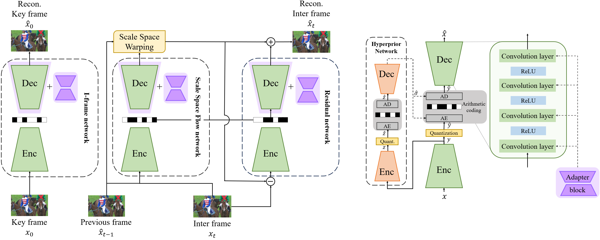

# Parameter-Efficient Instance-Adaptive Neural Video Compression
Hyunmo Yang*, Seungjun Oh*, and Eunbyung Park

### [[Paper(arxiv)](https://arxiv.org/abs/2405.08530)]
An official implementation of "Parameter-Efficient Instance-Adaptive Neural Video Compression".
*Learning-based Neural Video Codecs (NVCs) have emerged as a compelling alternative to the standard video codecs, demonstrating promising performance, and simple and easily maintainable pipelines. However, NVCs often fall short of compression performance and occasionally exhibit poor generalization capability due to inference-only compression scheme and their dependence on training data. The instance-adaptive video compression techniques have recently been suggested as a viable solution, fine-tuning the encoder or decoder networks for a particular test instance video. However, fine-tuning all the model parameters incurs high computational costs, increases the bitrates, and often leads to unstable training. In this work, we propose a parameter-efficient instance-adaptive video compression framework. Inspired by the remarkable success of parameter-efficient fine-tuning on large-scale neural network models, we propose to use a lightweight adapter module that can be easily attached to the pretrained NVCs and fine-tuned for test video sequences. The resulting algorithm significantly improves compression performance and reduces the encoding time compared to the existing instant-adaptive video compression algorithms. Furthermore, the suggested fine-tuning method enhances the robustness of the training process, allowing for the proposed method to be widely used in many practical settings. We conducted extensive experiments on various standard benchmark datasets, including UVG, MCL-JVC, and HEVC sequences, and the experimental results have shown a significant improvement in rate-distortion (RD) curves (up to 5 dB PSNR improvements) and BD rates compared to the baselines NVC.*



## Requirements
Python 3.7+ and Conda
Set environment
```
conda create -n $env_name python=3.7
conda activate $env_name
pip install -r requirements.txt
```

## Prepare dataset
Convert the video file into images, and place all the images into a single folder.
  
```
./dataset
   - im001.png
   - im002.png
   - im003.png
   - ...
```
Download UVG dataset [here.](https://ultravideo.fi/dataset.html)

## Running
```
python train.py --cuda -d <path to dataset> --quality <set between 1~9> -m <lora or repeat>
```

## Acknowledgement
Our code based on [CompressAI](https://github.com/InterDigitalInc/CompressAI), [LoRA-Torch](https://github.com/Baijiong-Lin/LoRA-Torch), and [Universal Deep Image Compression via Content-Adaptive Optimization with Adapters](https://github.com/kktsubota/universal-dic).

## License
This project is released under the MIT license.